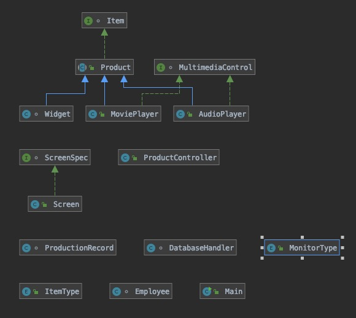

# ProductLineTrackerOOP

This Project is a simple and easy to understand application that will be used to keep track of productions that a company would make. It also keeps track of all the previous products that can be made and that were made all through the use of a database. I made the project independently. I made this project in the fall of 2019 while I was a Junior in the Software Engineering Program at Florida Gulf Coast University. I was not very experienced with creating an application of this sort when I started it. I made it for one of my classes, Object-Orientated Programming (OOP). It was for an assignment for this class. I learned a lot from making this project, not only just how to create a JavaFX application, but I learned about a lot of the OOP concepts. 

## Demonstration

## Documentation

[JavaDoc](https://github.com/SamKT17/ProductLineTrackerOOP/blob/master/docs/index.html)

## Diagrams

This is the Class Diagram:

This is the Database Diagram:

## Getting Started

For right now the only way to run the program is to have an IDE installed either being IntelliJ or Eclipse.

1. Download and install IntelliJ or Eclipse.
2. Go to https://github.com/SamKT17/ProductLineTrackerOOP and download the source code.
3. Then run the code in Intellij or Eclipse.

## Built With

 - Java 8
 - IntelliJ
 - SceneBuilder 
 - H2 Database

## Contributing

There are plenty of things to do to contribute to this project, but some of the key things to contribute would be more CSS and implementing more of the classes into the project (Employee class).

## Author

Samuel Thomas (SamTK17)

## Acknowledgments

 - Stackoverflow.com
 - Java Docs
 - Damian Morgan
 - Prof. Vanselow

## History

None yet.

## Key Programming Concepts Utilized

 - Encapsulation 
	 - I used this concept when creating the classes that were going to be instantiated, by creating fields that were private and no one could directly change or alter.
 - Polymorphism
	 - I used this concept with the product and widget classes, mainly because the product class was an abstract class and I used the widget class to "gain access" into the product class. In some of the controller I created an object of type Product, but instantiated it as a widget.
 - Inherritance
	 - I used this in the project when creating the project class and the widget class. The widget class is a child class to the Product class and the Product class implements the Item interface.
 - Enums
	 - I got more familiar with enums and how they work.
-	Interfaces and Abstract classes
	-	Had multiple of each of these in my project. I used an interface Item on the class Product. Also, the Product class was abstract so I had to use another class that extended Product called Widget.
- Regular Expressions
	- I used this when creating the employee class and more specifically I used it for the creation of the password for the employee. 

